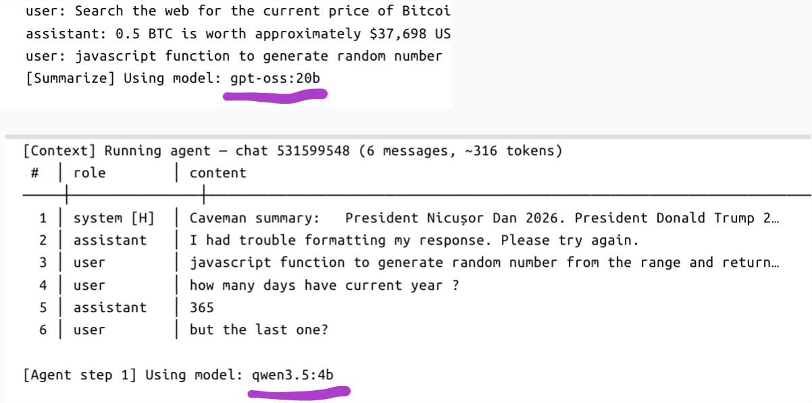

# TG Local LLM — Experiment Notes

## 1. Overview

A Telegram bot running a tiered local LLM setup for agentic tasks.

### Models Used

| Role | Model | Purpose |
|------|-------|---------|
| Orchestrator (4B) | `qwen3.5:4b` | Main agent — tool calls, Thought-Action-Observation loop |
| Heavyweight (20B) | `gpt-oss:20b` | Context summarization |
| Nano (0.8B) | `qwen3.5:0.8b` | Planned lightweight intent classifier |

### Tasks Tested

- **Intent classification** — categorizing the task type (0.8B)
- **History summarization** — compressing long conversations (20B)
- **Tool use (Math / Web Search)** — running Thought-Action-Observation cycles (4B)

---

## 2. Observations

### Which model performs best where?

**`qwen3.5:4b`** is the ideal balance. It reliably follows JSON format and doesn't drift into unnecessary reasoning. **`gpt-oss:20b`** excels as a "writer" — it produces high-quality summaries quickly without losing meaning.

### Where does the weak model break?

On the classification task, `qwen3.5:0.8b` hit a **reasoning explosion**: despite its small size, it ran longer than any other model, generating an endless stream of text instead of a single word — causing timeouts and loss of intent.

### Where is the strong model overkill?

`gpt-oss:20b` was useless for tool calling. It consistently broke JSON format by adding polite phrases or explanations, which crashed the agent parser. For strict structural tasks, its "intelligence" hurts precision.

---

## 3. Improvements

### What was changed

- For **0.8B**: introduced "caveman" instructions and a hard `max_tokens: 5` cap to stop runaway reasoning.
- For **20B**: removed the tool-use system prompt entirely, leaving only the summarization task — this reduced hallucinations and improved speed.

### What was dropped

Intent classification via `qwen3.5:0.8b` was removed entirely. The reasoning explosion made it unreliable, and the added complexity wasn't worth it — the 4B model handles routing well enough on its own.

### What actually worked

**Tiered architecture** — separating responsibilities so 4B handles only logic and 20B handles only archiving — noticeably improved overall stability. Simplifying the output format for the weak model also helped: replacing JSON with plain labels like `[TASK]` eliminated parse errors.

---

## 4. Conclusion

Model size does not guarantee success in agentic scenarios. Small models tend to loop without hard constraints; large models are too "talkative" for strict interfaces.

For agent loop control and tool calling, **`qwen3.5:4b`** is the best fit — it strikes the right balance between speed and strict JSON adherence, which is critical for automated systems.

---

