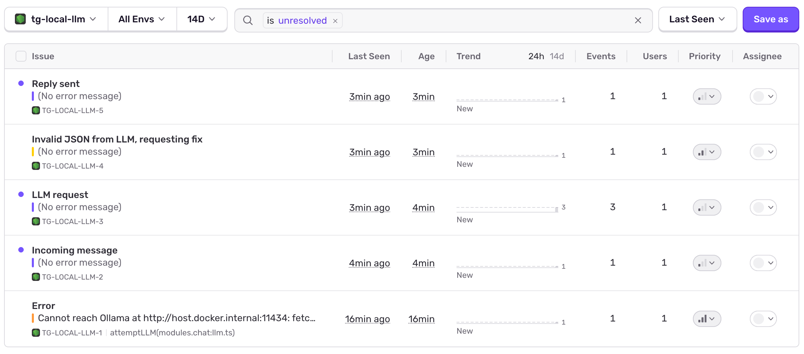
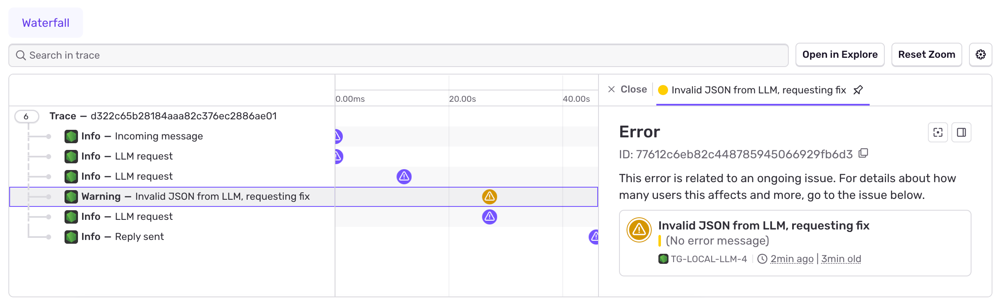

# TG Local LLM — Architecture Evolution

## Overview

A Telegram bot running a local LLM (via Ollama) with an agentic tool-use loop. This branch documents the evolution of the codebase from a flat single-layer structure into a modular monolith with an event-driven communication layer.

---

## Changelog

Now we can view the events in Sentry!

And can debug based on the trace ID!

